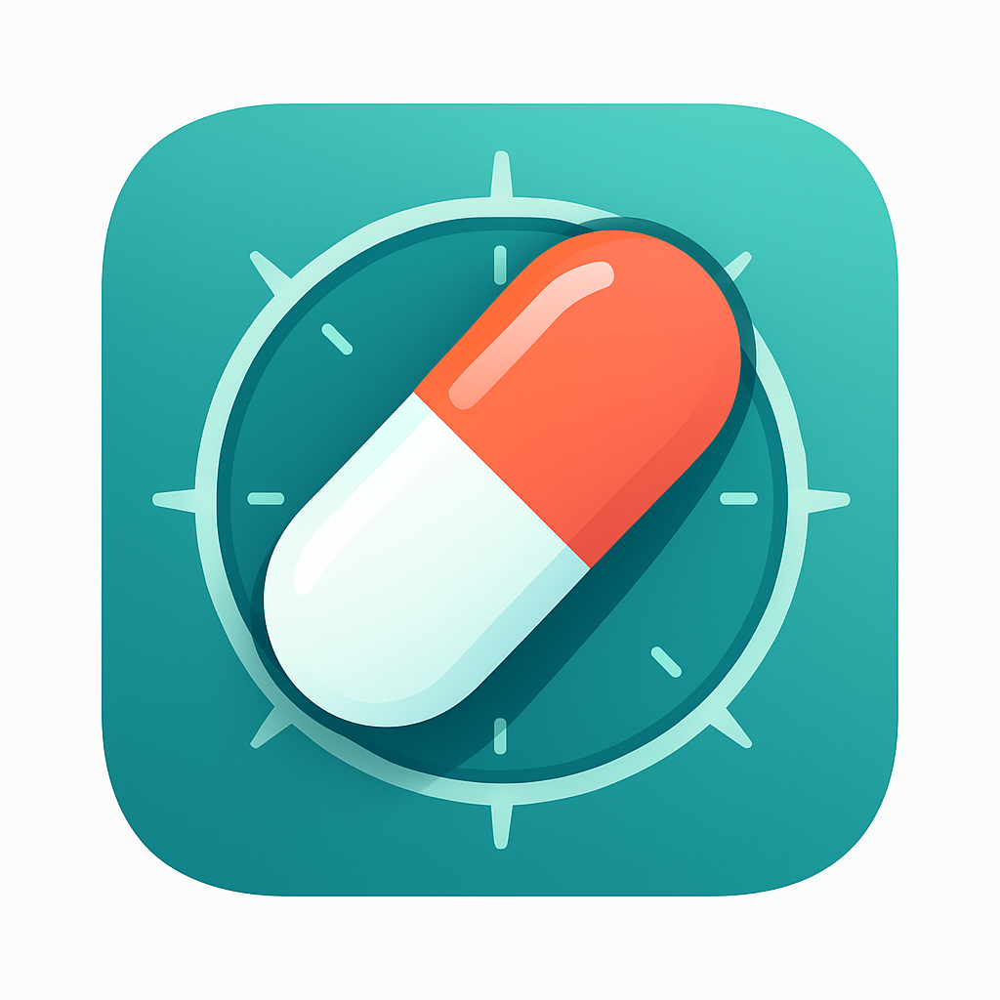

# PillPilot 💊

A modern, intuitive medication management app built with React Native and Expo. PillPilot helps users track medications, manage dosing schedules, and maintain their wellness journey with a beautiful, pill-shaped interface.



## ✨ Features

### 🏠 **Next Pill Dashboard**
- Personalized medication overview
- Smart scheduling recommendations
- Quick access to next dose information
- Beautiful pill-shaped navigation

### 💊 **Medication Management**
- Add and track multiple medications
- Detailed medication profiles
- Dosage tracking and history
- Medication inventory management
- Custom medication regimens

### 📅 **Smart Scheduling**
- Flexible dosing schedules
- Meal timing integration
- Custom constraints and rules
- Automated reminders and notifications
- Schedule optimization

### 🍽️ **Meal Integration**
- Meal timing coordination
- Food-medication interaction alerts
- Customizable meal schedules
- Dietary constraint management

### 🔔 **Notifications & Reminders**
- Push notification support
- Customizable reminder times
- Missed dose tracking
- Smart notification scheduling

### ⚙️ **Settings & Preferences**
- User preferences management
- App customization options
- Data export capabilities
- Privacy and security settings

## 🚀 Getting Started

### Prerequisites
- Node.js (v18 or higher)
- npm or yarn
- Expo CLI
- iOS Simulator (for iOS development)
- Android Studio (for Android development)

### Installation

1. **Clone the repository**
   ```bash
   git clone <repository-url>
   cd PillPilot-new
   ```

2. **Install dependencies**
   ```bash
   npm install
   # or
   yarn install
   ```

3. **Start the development server**
   ```bash
   npx expo start
   ```

4. **Run on your device/simulator**
   - Press `i` for iOS simulator
   - Press `a` for Android emulator
   - Scan QR code with Expo Go app on your device

## 🏗️ Project Structure

```
PillPilot-new/
├── src/
│   ├── components/          # Reusable UI components
│   │   └── ui/             # Base UI components (Button, Card, Input, etc.)
│   ├── navigation/          # Navigation configuration
│   │   └── AppNavigator.tsx # Main navigation setup
│   ├── screens/             # App screens
│   │   ├── TodayScreen.tsx  # Next Pill dashboard
│   │   ├── MedicationsScreen.tsx # Medication list
│   │   ├── AddMedicationScreen.tsx # Add new medication
│   │   ├── ScheduleScreen.tsx # Scheduling interface
│   │   ├── SettingsScreen.tsx # App settings
│   │   └── ...              # Additional screens
│   ├── services/            # Business logic and data services
│   │   ├── DatabaseService.ts # SQLite database operations
│   │   ├── NotificationService.ts # Push notifications
│   │   ├── SchedulingService.ts # Medication scheduling
│   │   ├── MealTimingService.ts # Meal coordination
│   │   └── NextPillService.ts # Dashboard logic
│   ├── theme/               # App theming and styling
│   │   ├── theme.ts         # Theme configuration
│   │   └── tokens.json      # Design tokens
│   └── types/               # TypeScript type definitions
├── assets/                  # Images and static assets
├── App.tsx                  # Main app component
└── package.json             # Dependencies and scripts
```

## 🛠️ Tech Stack

- **Frontend**: React Native 0.79.5
- **Framework**: Expo SDK 53
- **Language**: TypeScript 5.8.3
- **Navigation**: React Navigation 7
- **Database**: Expo SQLite
- **UI Components**: Custom components with Expo Blur and Linear Gradient
- **Icons**: Expo Vector Icons (Ionicons)
- **State Management**: React Context API
- **Notifications**: Expo Notifications

## 🎨 Design Features

### Pill-Shaped Navigation
- Custom pill-shaped bottom navigation bar
- Gradient color transitions (teal theme)
- Glass morphism effects with blur
- Elevated add button with accent colors

### Modern UI/UX
- Clean, minimalist design
- Smooth animations and transitions
- Responsive layout for all screen sizes
- Accessibility-friendly interface

### Color Scheme
- Primary: Teal (#12A5A2, #3BC5BF)
- Accent: Orange (#FF6B35)
- Background: White and light grays
- Text: Dark grays and black

## 📱 Screenshots

The app features several key screens:

- **Next Pill**: Personalized medication dashboard
- **Medications**: Complete medication management
- **Add**: Quick medication addition
- **Schedule**: Smart scheduling interface
- **Settings**: App configuration and preferences

## 🔧 Configuration

### Environment Setup
The app automatically configures:
- SQLite database initialization
- Notification permissions
- Meal timing services
- User preferences

### Customization
- Modify colors in `src/theme/tokens.json`
- Update navigation in `src/navigation/AppNavigator.tsx`
- Customize components in `src/components/ui/`

## 📊 Database Schema

The app uses SQLite with the following main tables:
- `medications`: Medication information
- `regimens`: Dosing schedules
- `constraints`: Medication rules
- `meal_events`: Meal timing data
- `dose_events`: Medication dose history
- `inventory`: Medication stock
- `user_prefs`: User preferences

## 🚀 Deployment

### Building for Production
```bash
# Build for iOS
npx expo build:ios

# Build for Android
npx expo build:android

# Build for web
npx expo build:web
```

### App Store Deployment
1. Configure app.json with your app details
2. Build production versions
3. Submit to App Store and Google Play Store

## 🤝 Contributing

1. Fork the repository
2. Create a feature branch (`git checkout -b feature/AmazingFeature`)
3. Commit your changes (`git commit -m 'Add some AmazingFeature'`)
4. Push to the branch (`git push origin feature/AmazingFeature`)
5. Open a Pull Request

## 📄 License

This project is licensed under the MIT License - see the [LICENSE](LICENSE) file for details.

## 🙏 Acknowledgments

- Built with [Expo](https://expo.dev/)
- Icons from [Ionicons](https://ionic.io/ionicons)
- UI inspiration from modern mobile design patterns

## 📞 Support

For support and questions:
- Create an issue in this repository
- Check the [Expo documentation](https://docs.expo.dev/)
- Review React Native best practices

---

**PillPilot** - Your personalized medication journey starts here! ✨
